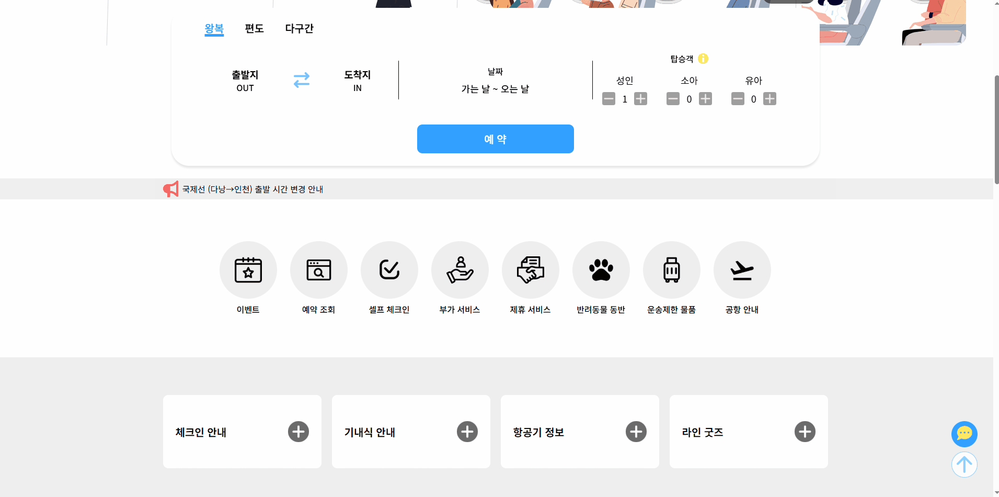
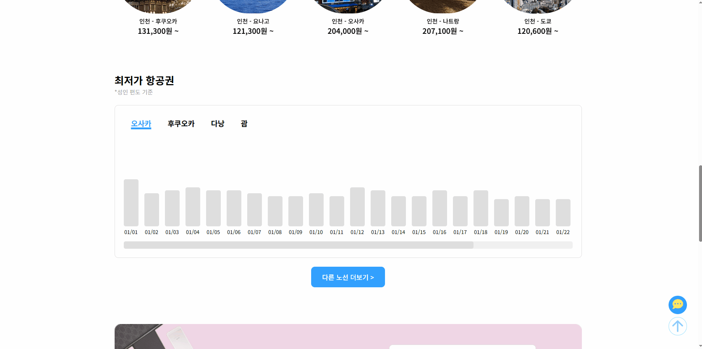

# ✈️ Air Seoul
팀원들과의 공통 관심사를 바탕으로 에어서울을 선정하여 사용자 경험을 개선하여 리뉴얼했습니다.

## 🛠️ 기술스택
- JavaScript
- jQuery
- Scss
- Swiper

## 📌 주요 기능
- 반응형 웹 구현 (Media Query 활용)
- 빠른 예약 입력 및 선택 값 실시간 UI 반영
- 항공권 가격 데이터를 활용한 막대 그래프 구현


## 🧠 설계 및 구현 과정
### 1. 반응형 웹 구현 
- 모바일, 태블릿, PC 환경에 맞춰 레이아웃 분기 설계
- 태블릿 구간의 해상도 차이를 고려하여 2개의 브레이크포인트로 세분화 구현
- 콘텐츠 레이아웃 붕괴를 방지하기 위해 브레이크포인트를 전략적으로 설정

| 반응형 웹 |
| :--: |
|  |

```css
@media all and (min-width: 601px) and (max-width: 768px) {...}
@media all and (min-width: 769px) and (max-width: 1024px) {...}
@media all and (min-width: 1025px) {...}
```

### 2. 빠른 에약 기능
- isOneWay 상태값을 기준으로 편도/왕복 UI 분기 설계
- 날짜 선택 값을 startTd, endTd로 관리하여 선택 범위 시각화
- 선택된 예약 정보를 객체로 수집 후 키 값으로 직렬화하여 예약 식별자 생성
- JSON 항공권 가격 데이터를 날짜 기준으로 매칭하여 합산 처리
- 예약 완료 시 모달을 통해 결과 화면을 동적으로 렌더링

| 빠른 예약 |
| :--: |
|  |

#### 왕복 / 편도 
> 편도 / 왕복 변경
```javascript
let isOneWay = false;

oneWayBtn.addEventListener('change', () => {
    isOneWay = true;
    fullReset();
});

roundTripBtn.addEventListener('change', () => {
    isOneWay = false;
    fullReset();
});
```

#### 날짜 선택 및 범위 시각화
> 가는 날, 오는 날 설정 & 두 날짜 사이의 구간을 시각화
```javascript
if (!startTd || (startTd && endTd)) {
    startTd = td;
    endTd = null;
    td.classList.add('day_select');
} else if (!endTd) {
    endTd = td;
    td.classList.add('day_select');
    hightlightBetween();
}
```

#### 가격 합산 처리
> 선택된 날짜의 가격 데이터를 조회하여 Number로 변환하여 합산
```javascript
function updateTotalPrice(){
    let total = 0;
    if(fromData) total += Number(fromData.price);
    if(toData) total += Number(toData.price);

    totalEl.textContent = total.toLocaleString() + ' 원';
}
```

#### 예약 식별자 & 항공권 번호 생성
> 고유 Key를 생성, 중복 여부 판단 & 입력값 기반 고유 번호 생성
```javascript
// 
function makeReservationKey(data){
    return [
        data.from,
        data.to,
        data.fromDay,
        data.toDay,
        data.adult
    ].join('|');
}

// 
function generateTicketNumberFromKey(key){
    let hash = 0;
    for(let i = 0; i < key.length; i++){
        hash = (hash * 31 + key.charCodeAt(i)) % 10000000;
    }
    return `724-${String(hash).padStart(7,'0')}`;
}
```

### 3. 최저가 항공권 그래프
- 월별 항공권 가격 JSON 데이터를 기반으로 막대 그래프 구현
- 가격 비율 계산을 통해 높이 동적 조정
- 최저가 자동 탐지 및 강조 표시
- 클릭 시 툴팁을 통해 해당 날짜 가격 정보 제공
- 국가 선택 버튼에 따라 데이터 재렌더링

| 최저가 항공권 |
| :--: |
|  |

#### JSON 데이터를 기반 그래프 구현
> 월별 JSON 가격 데이터를 불러와 28일을 기준으로 가공
```javascript
function renderGraph(dataKey) {
    const fullData = priceDate[dataKey]; 
    if (!fullData) return;

    currentPriceArray = fullData.slice(0, 28);
}
```

#### 가격에 따른 막대 그래프 높이 계산
> 가격을 기준으로 비율 계산하여 막대 높이 동적 설정
```javascript
const height = Math.max(unitHeight, (price / unitPrice) * unitHeight);
bar.style.height = `${height}px`;
```

#### 최저가 자동 강조 처리
> 전체 가격 중 최저값을 계산하여 해당 날짜의 막대 자동 강조 표시
```javascript
const minPrice = Math.min(...prices.filter(p => p > 0));
bar.style.backgroundColor = (price === minPrice) ? '#FF6565' : '';
```

#### 클릭 시 툴팁 표시
> 클릭한 막대 위에 툴팁을 동적으로 삽입
```javascript
bar.onclick = () => {
    li.appendChild(tooltipBox);
    tooltipBox.querySelector('.price').textContent = 
        `${price.toLocaleString()}원`;
    tooltipBox.classList.add('lowest_price_on');
};
```

#### 🔧 트러블슈팅: 최저가 항공권 그래프 색상
#### 개선 전
> 여러 나라(예: 오사카, 다낭, 후쿠오카, 괌) 가격 그래프에서 최저가를 강조하려고 했지만, 실제로는 전체 그래프 중 단 하나의 최저가만 색상이 적용되어 혼동이 발생
각 나라별 최저가를 직관적으로 구분하기 어려움

#### 개선 후
> 각 나라별 최저가 그래프를 시각적으로 구분하기 위해, 가격 배열(prices)에서 0보다 큰 값 중 최저가를 구하고, 해당 그래프의 색상을 변경
```javascript
const minPrice = Math.min(...prices.filter(p => p > 0));
lis.forEach((li, index) => {
    const item = currentPriceArray[index];
    const bar = li.querySelector('.graph');
    const price = Number(item.price);
    bar.style.backgroundColor = (price === minPrice) ? '#FF6565' : '';
    ...
}
```

### ✨ 프로젝트를 통해
만들어본 사이트들 중 기능적으로 가장 어려웠고, 막히는 부분이 많아 검색과 AI를 활용하며 하나씩 해결해 나갔습니다. 이 프로젝트를 완전히 이해하지 못한 부분도 있어, 지금도 다시 공부하며 배우고 있습니다.
